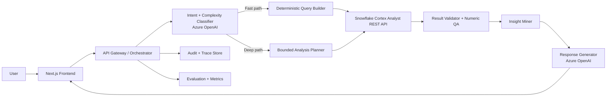

# Conversational Analytics Agent Master Plan

## 1) Product Objectives and Constraints

### Core objectives
- Minimal latency: users should get useful answers quickly, then progressively deeper insight.
- Maximum insight and data quality: numbers must be right, insight should be decision-useful.
- Nontechnical UX: natural language in, intuitive answer out.
- Multi-turn + multi-step reasoning: retain context, resolve references, and support drill-down.

### Hard constraints
- SQL generation and execution through Snowflake Cortex Analyst REST API.
- LLM reasoning and narration through Azure OpenAI.
- Deployment in a highly regulated banking environment (auditability, predictability, controls).

## 2) Architecture Options (Spectrum)

### Option A: Rigid deterministic workflow
- Fixed stages and strict logic for every request.
- Best for predictability and low latency.
- Weakness: lower ceiling for complex synthesis and novel insights.

### Option B: Fully agentic tool loop
- Planner can iterate over tools (SQL writer, calculator, dataframe, etc.) until done.
- Best ceiling for exploratory analysis.
- Weakness: variable latency, harder evaluation, harder compliance/audit.

### Option C: Bounded agent inside deterministic workflow (recommended)
- Deterministic outer pipeline with policy gates.
- Limited agentic reasoning in specific bounded steps (plan generation, insight expansion).
- Strong balance of latency, quality, and governance.

### Option D: Dual-path runtime (recommended implementation shape)
- Fast path: deterministic single-query or simple 2-step responses.
- Deep path: bounded multi-step workflow for complex asks.
- Route by complexity classifier and confidence signals.

## 3) Reference System Design

## 4) Service Boundaries

### 4.1 Frontend (Next.js + Tailwind)
- App Router + server actions/route handlers.
- Core pages:
  - `/` Workspace and query composer.
  - `/chat/[sessionId]` Multi-turn analytics conversation.
  - `/trace/[traceId]` Internal explainability and audit view (role-restricted).
  - `/admin/evals` Evaluation dashboard (role-restricted).
- Core UI components:
  - Conversational thread with structured cards.
  - Insight cards (headline, evidence, confidence).
  - Data table with pivots + sortable dimensions.
  - Time-series/segment charts.
  - Assumption and filter chips.
  - Suggested follow-up actions/questions.
- UX principles:
  - Progressive reveal: answer first, deeper breakdown in expandable panels.
  - "Why this answer" pane showing data sources, SQL ids, and confidence.
  - Guardrail messages for ambiguous requests and restricted data.

### 4.2 Orchestrator API (backend)
- Responsibilities:
  - Session state management.
  - Intent classification and route selection.
  - Step orchestration and policy enforcement.
  - Tool calls to Cortex Analyst and Azure OpenAI.
  - Validation, insight extraction, response packaging.
- Suggested endpoints:
  - `POST /api/chat/turn`
  - `GET /api/chat/session/:id`
  - `GET /api/trace/:traceId`
  - `POST /api/eval/run` (internal)

### 4.3 Data and Semantics Layer
- Curated semantic contract over allowed tables:
  - metric definitions
  - dimension definitions
  - allowed joins / join graph
  - sensitive fields and masking policies
  - freshness and quality metadata
- Versioned contract required for deterministic behavior and regression testing.

### 4.4 QA and Insight Layer
- Numeric QA checks before response generation:
  - row-count sanity, null checks
  - denominator and ratio validity
  - subtotal-to-total reconciliation
  - time window consistency
- Insight miner:
  - deterministic tests (trend shifts, concentration, outliers, segment drivers)
  - LLM turns validated findings into concise narrative

## 5) Conversation Intelligence Design

### 5.1 Structured conversation state
Maintain explicit state per session:
- entities (products, regions, customer segments)
- metrics (requested and inferred)
- filters/time windows
- unresolved ambiguities
- prior result handles and confidence

### 5.2 Multi-turn logic
- Reference resolution: pronouns and shorthand ("that segment", "last quarter").
- Constraint carry-forward with user override detection.
- Contradiction detection and clarification prompts when needed.

### 5.3 Multi-step workflow (deep path)
1. Understand request and decompose into steps.
2. Generate SQL per step through Cortex Analyst.
3. Validate each result; fail fast on bad quality.
4. Merge and compute derived comparisons.
5. Run insight tests and rank by user relevance.
6. Compose final response with traceable evidence.

## 6) Latency and Reliability Strategy

### 6.1 Latency budgets (initial targets)
- P50 end-to-end (fast path): <= 2.5s
- P95 end-to-end (fast path): <= 5s
- P50 end-to-end (deep path): <= 7s
- P95 end-to-end (deep path): <= 15s

### 6.2 Techniques
- Complexity routing to avoid unnecessary deep reasoning.
- Parallelize independent SQL steps in deep path.
- Aggressive caching:
  - semantic metadata cache
  - frequent question/query templates
  - recent session intermediate results
- Timeouts and graceful degradation:
  - return best validated partial insight with explicit caveat.

## 7) Governance and Compliance Controls

- Strict allowlist of schemas/tables/columns.
- PII tagging and masking at semantic layer.
- Row-level security preserved through Snowflake policies.
- Prompt and response policy checks for restricted disclosures.
- Full trace logging per turn:
  - user query
  - resolved intent
  - generated SQL ids
  - QA outputs
  - final response
- Deterministic replay mode for audits and incident review.

## 8) Evaluation Framework (non-negotiable)

### 8.1 Test corpus
- Golden set of real business questions:
  - single-step KPI lookups
  - period-over-period comparisons
  - multi-hop driver analysis
  - ambiguous user asks
  - adversarial edge cases

### 8.2 Metrics
- Intent accuracy
- SQL correctness
- Numeric correctness
- Insight usefulness/relevance (human + rubric)
- Citation/trace completeness
- Latency percentiles
- Safety/compliance pass rate

### 8.3 Release gates
- No regression in numeric correctness or compliance.
- Latency SLO adherence by path.
- Explainability and replay coverage 100%.

## 9) Frontend Plan (Next.js + Tailwind)

### 9.1 Tech choices
- Next.js 15+ (App Router, TypeScript)
- Tailwind CSS + component primitives (e.g., Radix/shadcn-style)
- Charting: ECharts or Recharts (choose one for consistency)
- State/query: React Query + lightweight client store
- Auth/roles: enterprise SSO integration (OIDC/SAML through company IdP)

### 9.2 UI information architecture
- Left rail: sessions, saved analyses, domain shortcuts.
- Main panel: conversational timeline with structured answer blocks.
- Right panel: filters, assumptions, data provenance, confidence.
- Bottom composer: NL query input + optional structured constraints.

### 9.3 Response card schema
- `Answer`: direct response in plain business language.
- `Evidence`: key metrics and supporting slices.
- `Insights`: ranked additional findings.
- `Confidence`: high/medium/low + reason.
- `Next best questions`: 3 suggested follow-ups.

## 10) Data Contracts and APIs

### 10.1 Turn request (frontend -> orchestrator)
- session id
- user message
- user role
- optional explicit filters

### 10.2 Turn response (orchestrator -> frontend)
- canonical answer text
- structured metrics payload
- chart/table payload
- ranked insights list
- assumptions + clarifications
- trace id + confidence + latency stats

### 10.3 Internal contracts
- `SemanticModelVersion`
- `PlanStep`
- `QueryResultArtifact`
- `ValidationReport`
- `InsightCandidate`

## 11) Implementation Roadmap (90 days)

### Phase 1 (Weeks 1-3): Foundations
- Define semantic contract for first 5-10 curated tables.
- Build orchestrator skeleton and session state model.
- Implement fast path with deterministic SQL generation.
- Build basic Next.js chat UI with answer/evidence cards.
- Add full trace logging.

### Phase 2 (Weeks 4-7): Deep path + QA
- Add bounded multi-step planner.
- Implement numeric QA pipeline and failure handling.
- Add insight miner (deterministic heuristics + narrative).
- Add follow-up suggestion generation.
- Ship initial evaluation harness and golden dataset.

### Phase 3 (Weeks 8-10): Compliance + hardening
- Integrate policy checks, PII controls, role-gated views.
- Build replay tooling and trace viewer.
- Optimize latency (parallelization + caching).
- Add canary release framework with regression gates.

### Phase 4 (Weeks 11-13): Pilot readiness
- UAT with analysts/business users.
- Tune prompts and routing thresholds.
- Finalize runbooks, alerts, and operational SLO dashboards.
- Prepare production launch checklist.

## 12) Suggested Initial Backlog (MVP)

1. Semantic model schema and governance process.
2. Complexity classifier prompt + calibration set.
3. Fast path turn handler + Cortex Analyst integration.
4. Numeric QA module with standardized error taxonomy.
5. Insight miner v1 (trend, contribution, anomaly).
6. Next.js conversation UI with structured response cards.
7. Trace viewer UI for internal users.
8. Evaluation runner + CI regression suite.
9. Observability dashboards (latency, errors, quality).
10. Security/compliance review package.

## 13) Key Decisions to Lock This Week

1. Single orchestrator service or split into microservices.
2. Exact semantic layer format and ownership model.
3. Chart library and UI component baseline for frontend.
4. Initial evaluation rubric and pass/fail thresholds.
5. Canary rollout strategy and rollback criteria.

